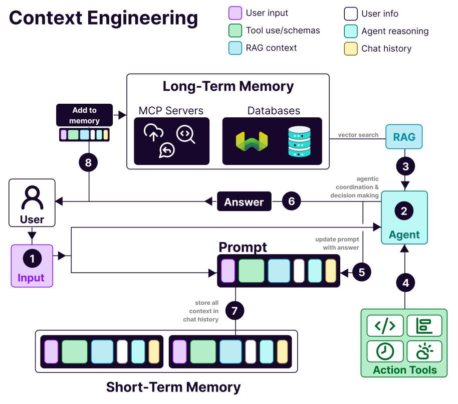

# Objetivo

Esta base tem como finalidade proporcionar um entendimento introdutório e estruturado dos conceitos básicos relacionados ao uso de inteligência artificial aplicada, com foco em estratégias de LLMs, orquestração de agentes, engenharia de contexto e protocolos de modelo. A estrutura organizada por temas facilita o aprendizado progressivo e prático.

# Estrutura

```
├── app
│ ├── contextEngineeringConcept
│ ├── guardrailsAI
│ ├── langchain
│ ├── langgraph
│ ├── llm_strategies
│ │ └── **pycache**
│ ├── modelContextProtocol
│ │ ├── githubv1
│ │ └── githubv2
│ └── orchestration
├── doc
│ ├── image
│ ├── Diagram.drawio
│ ├── 01 baseEstudo.md
│ ├── 02 langchain.md
│ ├── 03 langgraph.md
│ ├── 04 llm_strategies.md
│ ├── 05 Orchestration.md
│ ├── 06 Types of Agents.md
│ ├── 07 Model Context Protocol.md
│ ├── 08 Context engineering concept.md
```

## Sujestão de análise:

-   1-langchain
-   2-langgraph
-   3-llm_strategies
-   4-guardrailsAI
-   5-contextEngineeringConcept

# Conceitos chave

### Agentes de IA (AI Agents)

-   **Definição**: Um agente de inteligência artificial é um **software desenvolvido para realizar tarefas, tomando decisões e agindo de forma autônoma** com base em interações com o ambiente, com humanos e até com outros agentes.
-   **Mudança de Paradigma**: Diferentemente das assistentes atuais, onde apenas pedimos algo, os agentes permitem **delegar tarefas inteiras**. O desenvolvedor é o responsável por fazer isso funcionar corretamente.
-   **Funcionamento**:
    -   Utilizam **LLMs (Large Language Models)** para processar informações e determinar as ações necessárias para cumprir uma tarefa.
    -   Não seguem uma lista fixa de comandos; são capazes de **aprender com o contexto** e serem treinados com novos dados.
    -   Podem **interagir com outras ferramentas** como APIs de outros sistemas e até outros agentes.
    -   Funcionam em um ciclo de **planejar, executar e aprender** com suas ações, utilizando memória para comparações e obtenção de informações.
    -   **Etapas**: Quando recebem uma tarefa, eles:
        1.  **Definem um objetivo**.
        2.  **Criam um plano** detalhando as ações.
        3.  Entram na etapa de **execução**, onde utilizam **"tools" (ferramentas)** como acesso a banco de dados, APIs, internet, serviços e até outros agentes. Essa capacidade de conexão amplia muito seu poder.
        4.  Podem acessar **bases de dados exclusivas**, sendo treinados com dados específicos de uma área ou empresa, incluindo dados privados, frequentemente usando RAG (Retrieval Augmented Generation).
        5.  O resultado é **avaliado**; se correto, é entregue; se errado, o agente retorna à etapa de planejamento.
-   **Viabilidade**: Tornaram-se viáveis porque os LLMs se tornaram "pensantes", capazes de resolver problemas complexos de forma mais estruturada e interpretável.

#### Estratégias para LLMs em Agentes:

Para que os LLMs resolvam problemas complexos, existem três estratégias principais:

-   **Chain of Thought (Cadeia de Pensamento)**: O modelo é incentivado a gerar **etapas intermediárias de raciocínio** antes de chegar à resposta final, melhorando a resolução de tarefas complexas de raciocínio.
-   **ReAct (Reasoning + Acting)**: Combina raciocínio com ação, agindo em ciclos que **alternam entre descrever o que está fazendo e executando a ação**, podendo chamar "tools".
-   **Tree of Thoughts (Árvore de Pensamentos)**: Uma evolução do Chain of Thought, onde o modelo considera **múltiplas possibilidades**, ramificando as decisões como uma árvore. Ajuda a criar diferentes caminhos, avaliar cada um e escolher o melhor para problemas complexos.

| Estratégia       | Quando usar                                        | Benefício principal             |
| ---------------- | -------------------------------------------------- | ------------------------------- |
| Chain of Thought | Problemas com cálculo, lógica, etapas              | Clareza no raciocínio           |
| ReAct            | Acesso a ferramentas externas (ex: arquivos, APIs) | Raciocínio + ação externa       |
| Tree of Thoughts | Explorar várias soluções antes de decidir          | Avaliação de múltiplos caminhos |

### Termos e Conceitos Importantes:

-   **Guard Rails**: São uma **camada de segurança** que intercepta e gerencia entradas (inputs), saídas (outputs) e o comportamento das conversas com a IA generativa. Permitem controlar a saída do modelo, definir estruturas pré-estabelecidas (como JSON) e criar regras para inputs (ex: não compartilhar informações pessoais). Existem frameworks especializados como o Nemore Guardrails da Nvidia, Chatbot Guardrails, Arena do Hugging Face e Guardrails AI.
-   **Orquestração**: É a **condução dos agentes para que trabalhem corretamente juntos**, como um maestro regendo uma orquestra. Vai além, sendo responsável pela **integração de agentes de IA com outros modelos, ferramentas e fontes de dados** para automatizar e gerenciar sistemas maiores de IA. Na prática, coordena múltiplos agentes com papéis distintos (planejar, executar, validar), gerencia o fluxo de informações entre eles, prioriza a tomada de decisão e inclui controles e guardrails. Também integra humanos no loop para aprovação, revisão e orientação em partes críticas.
-   **Memória**: Essencial para o design e funcionamento dos agentes, permitindo lembrar, contextualizar e reutilizar informações anteriores.
    -   **Memória de Curto Prazo (Short-Term Memory)**: Armazena o **contexto recente da conversa** (histórico da interação atual). É volátil, durando apenas enquanto o agente está engajado no ciclo de diálogo, e é limitada pelo número máximo de tokens do modelo.
    -   **Memória de Longo Prazo (Long-Term Memory)**: Armazena **informações persistentes e reutilizáveis** que ultrapassam uma única conversa ou sessão. Permite ao agente "lembrar" do usuário, decisões passadas, preferências ou conhecimento técnico. Geralmente implementada usando bancos de dados vetoriais como Pinecone, Weaviate, Faiss ou Chroma.

### Tipos de Agentes Comuns:

Os agentes são versáteis, e existem vários tipos:

-   **Simple Reflex Agents**: Tomam decisões baseadas **exclusivamente no momento atual** (regra condicional "se isso, faça aquilo"). Não têm memória e são baseados em regras fixas.
-   **Model Based Reflex Agents**: Possuem **memória de estado interno**, o que os permite perceber o ambiente, preencher informações ausentes e tomar decisões com base na compreensão do contexto.
-   **Utility Based Agents**: Usam uma **função de utilidade** para tomar decisões, ideal quando há diversas soluções e o agente precisa escolher a melhor considerando benefício, satisfação, conforto, etc..
-   **Goal Based Agents**: Tomam **decisões orientadas por metas**, considerando as consequências de suas ações para atingir seus objetivos, lidando com cenários mais complexos.
-   **Learning Agents**: Se aprimoram ao longo do tempo por meio de **aprendizado por reforço (reinforcement learning)**, ótimos para funções que precisam se adaptar a novos contextos.
-   **Hierarchical Agents**: Organizados em camadas, onde um agente de nível superior quebra uma tarefa complexa em tarefas menores e as passa para agentes de nível inferior. O agente superior coleta os resultados e coordena os subordinados para garantir o resultado final.

### Dicas para Design de Agentes (Agent Design):

O processo de planejar, estruturar e implementar o comportamento e arquitetura de um agente:

-   **Foque na Tarefa, não no Agente**: Defina **instruções claras** para as tarefas, especificando inputs e outputs desejados, e forneça exemplos e contextos.
-   **Defina Objetivos Claros**.
-   **Colete/Receba Informações**: Os dados são fundamentais; dados ruins comprometem a tarefa.
-   **Escolha o Tipo de Agente Ideal**.
-   **Integre com Outros Sistemas**: Ex: CRM.
-   **Monitore e Otimize Sempre**.
-   **Garanta a Segurança e Privacidade** dos dados.
-   Exemplos de ferramentas para design de agentes incluem LangChain (que permite escolher um modelo base, conectar ferramentas via ReAct, sistema de memória embutido, guardrails e logging), Semantic Kernel, CrewAI, Rayck, Autogen da Microsoft, Google ADK, OpenAI Platform, AWS Bedrock Agents e Microsoft Copilot Studio.

### Padrões de Comunicação:

-   **Agent to Agents Protocol**: Desenvolvido pelo Google e mantido pela Linux Foundation, é um **protocolo aberto de interoperabilidade entre agentes independentes**.
-   **Model Context Protocol (MCP)**: Criado pela Anthropic, é um **protocolo open-source que padroniza como agentes ou LLMs invocam ferramentas externas, APIs e sistemas**. Rapidamente se tornou o **principal protocolo para troca de informações**, e até o Windows já o aceita nativamente. **Trabalha em conjunto com o Agent to Agents Protocol**.

### Desafios dos Agentes de IA:

Apesar do avanço, há desafios:

-   **Alucinações e Falhas de Raciocínio**: Podem levar a decisões equivocadas, exigindo testes rigorosos, guardrails e monitoramento.
-   **Latência e Custo**: Podem ser lentos e caros, especialmente em tarefas longas ou que exigem muita memória/contexto.
-   **Complexidade na Orquestração**: Exige uma arquitetura sofisticada.
-   **Segurança e Controle**: Dar autonomia para acessar sistemas ou executar ações reais (deletar arquivos, enviar e-mails) levanta sérias questões de segurança.
-   **Curva de Aprendizado**: Criar agentes bem estruturados exige diversos conhecimentos em LLMs, engenharia de prompt, APIs externas e design de sistemas autônomos.

Esses são os conceitos chave para um desenvolvedor entender os agentes de IA e como o MCP se encaixa nesse ecossistema, permitindo interações padronizadas entre eles e outras ferramentas.

## MCP


## Context Engineering



A imagem mostra o fluxo de **Context Engineering** para sistemas de IA baseados em agentes com memória.

1. **Usuário envia Input** → inicia o processo.
2. **Agente interpreta o Input** e usa:
3. **RAG (Retrieval-Augmented Generation)** para buscar informações externas.
4. **Ferramentas externas (Action Tools)** para executar ações ou acessar dados.
5. **Prompt é atualizado** com os resultados obtidos.
6. **Resposta é gerada** para o usuário.
7. **Histórico da conversa (Short-Term Memory)** armazena o contexto imediato.
8. **Memória de Longo Prazo (MCP Servers, Databases)** recebe dados relevantes para consultas futuras.

As cores indicam os tipos de dados: entrada do usuário, raciocínio do agente, uso de ferramentas, contexto RAG, informações do usuário e histórico da conversa.

# Passo 1 — Instalar dependências mínimas:

### Crie o ambiente virtual

python3.10 -m venv .venv

### Ative o ambiente virtual

#### No Linux/macOS:

source .venv/bin/activate

#### No Windows (PowerShell):

.venv\Scripts\Activate.ps1

#### No Windows (CMD):

.venv\Scripts\activate.bat

### Instalando as dependências:

Para instalar todas as dependências listadas no arquivo requirements.txt, use o seguinte comando no terminal:

```bash
pip install -r requirements.txt
```

Executar:

```bash
python app/main.py
```

Principais bibliotecas usadas:

```bash
 pip install langchain langgraph langsmith openai langchain-openai langchain-community python-dotenv guardrails-ai
```

Principais bibliotecas utilizadas:

-   LangChain e LangGraph — para criação de agentes e orquestração de fluxos com LLMs.
-   OpenAI e LiteLLM — acesso e compatibilidade com múltiplos provedores de IA.
-   Guardrails AI — para validação e controle das saídas dos modelos.
-   Pydantic e Dataclasses JSON — para modelagem e validação estruturada de dados.
-   HTTPX, Aiohttp e PyGithub — integração com APIs REST e GitHub.
-   SQLAlchemy — ORM para banco de dados.
-   OpenTelemetry — rastreamento e observabilidade.

#### Passo 2 — configurar o .env:

```
OPENAI_API_KEY=
# MCP GITHUB
GITHUB_TOKEN=
GITHUB_USERNAME=
GITHUB_REPO=
```

#### Passo 3 — Analizar cada código:

Sequência sugerida:

Inicia-se em main.py

Depois siga os diretórios:

-   1-langchain
-   2-langgraph
-   3-llm_strategies
-   4-guardrailsAI
-   5-contextEngineeringConcept

Executar:

```bash
python app/main.py
```

## Extras:

### Como gerar o requirements.txt

```bash
pip freeze > requirements.txt
```

### Desativar o venv

```bash
deactivate
```
